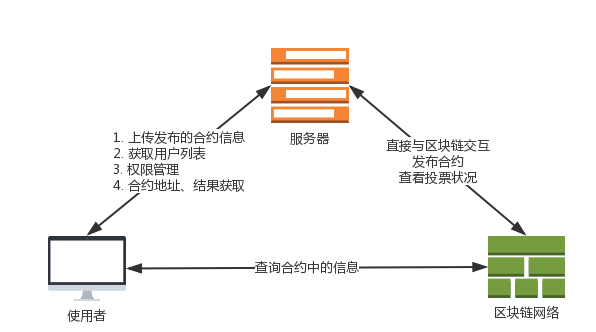
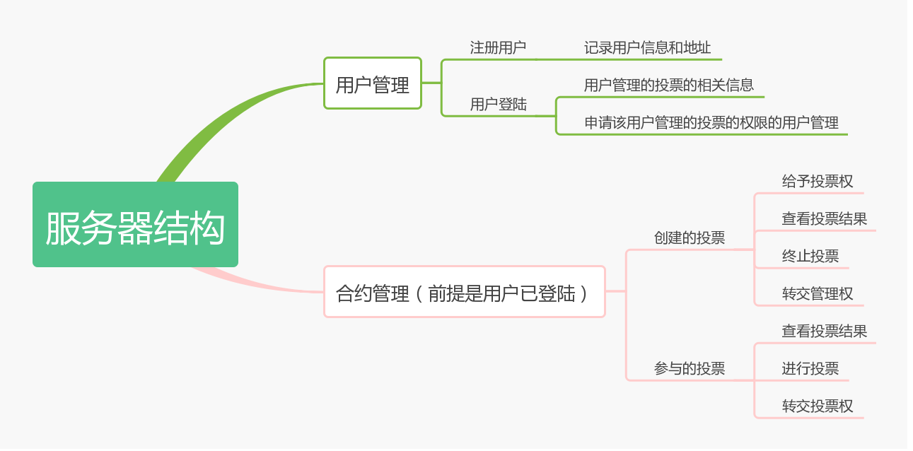
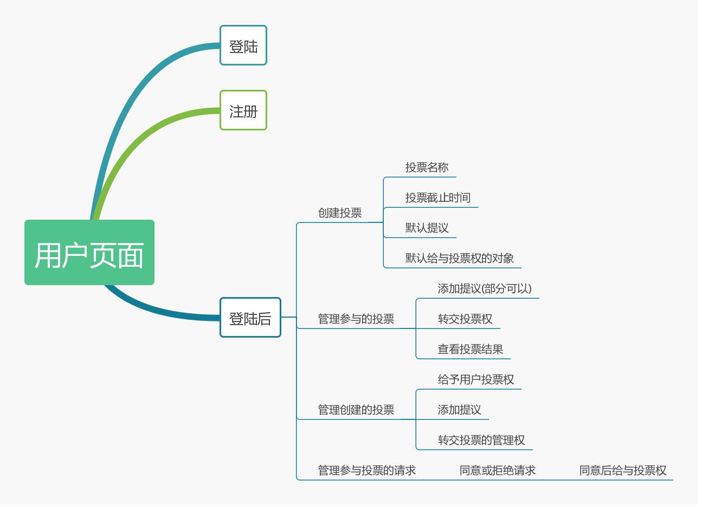
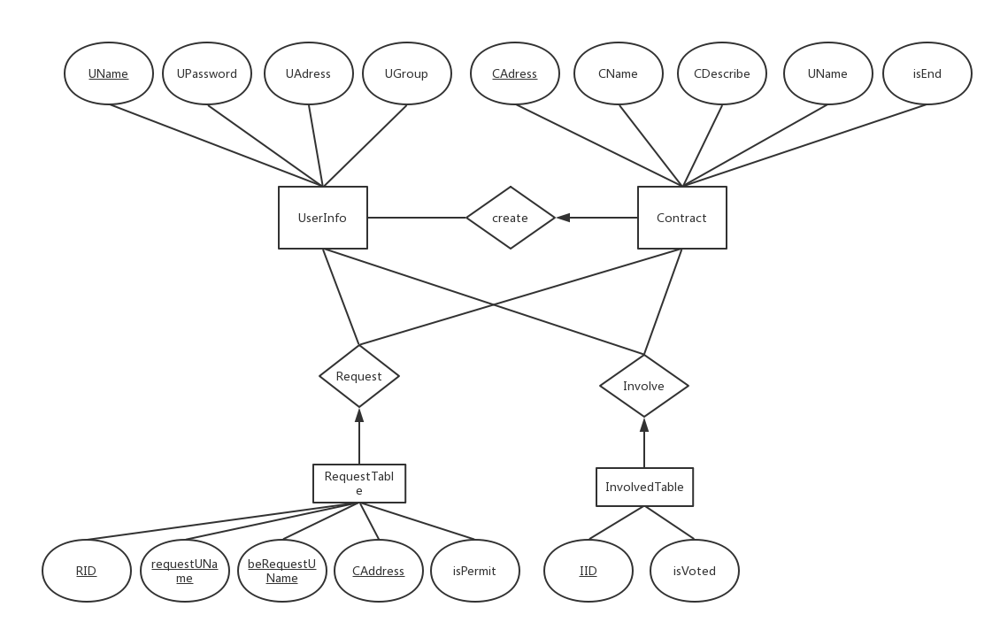

# 区块链项目

## 项目地址

## [GITHUB](https://github.com/Liux276/BlockChainProject)

## 选题背景

### 基于区块链的新型投票系统

#### 一、选题构思

1. 投票是进行选举和表决的必要手段，但是从古至今投票一直是高度中心化，篡改投票结果屡屡发生，并且需要匿名投票的地方也不能保证完全匿名，传统投票系统是一个高度中心化的不可信系统。
2. 区块链具有匿名性、去中心化、不可篡改、输出可信的特点。简单的区块链投票系统已经有不少了，但是简单的投票系统面临着许多问题，如：
   - 投票被写进区块中需要矿工的打包确认，交易可能失败，并不能保证可用性即不能保证投票的结果一定会被记录，所有这个方面还需要改进。
   - 传统 POS 的处理能力有限，如果不进行优化，投票系统的处理能力就比较差，不能支持比较多的投票事件。
   - 大多数投票系统都没有考虑投票者的身份验证，在保证投票匿名的前提下，在投票前验证投票者的身份和是否已经投票。这个在传统的需要保证匿名的投票系统中是不可能实现的，是否重复投票只能靠投票者的自觉，所以很容易造假，比如美国大选中一部分人为了某些目的反复重新投票。

#### 二、选题背景

投票是二十一世纪人类民主的象征，是诸多重要决议进行的手段。将权力给与投票者，投票者不受外界控制，匿名投票是社会进步的象征。传统投票需要大量的人力物力来组织活动，需要诸多机构人员参与统计并反复审核，浪费了人力物力；并且高度中心化的系统，处处留有可以进行篡改的漏洞；匿名机制导致无法控制投票者投票的次数；这些问题都可以使用区块链在较小的开销、可信的系统、中立的机制中解决，所以我认为这个选题是比较有意义的。

---

## 项目设计

#### 1. 服务结构

虽然中心化服务器使得合约操作有了中心化风险，但是在当前智能合约性能较弱、功能不完善的时候中心化服务器有利于集中管理、提高服务性能、提供附加服务。

#### 2. 服务器结构设计

除了基本的用户注册、用户账户信息存储、合约基本信息存储、附加服务如请求加入合约，其余操作均由服务器在区块链上进行操作。数据库中只存储基本信息。

#### 3. 用户页面设计

提供合约操作的图形化接口，尽可能使用户直观、方便、快捷地进行合约操作，免去不方便地命令行等直接操作。

#### 4. 数据库设计

数据库只用于存储基本信息，如用户信息、合约信息、请求信息、参与表。其余信息和操作都通过区块链来进行。

---

## 使用说明

#### 1. 登录与注册

